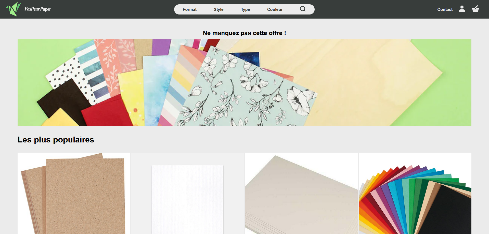

# PasPeur-Paper

a Flask web e-shop app for a school project

## Preview



## How to use

### Pulling the repository

```bash
git clone https://github.com/strawhattom/PasPeur-Paper.git
cd ./PasPeur-Paper
```

### Creating a venv for the project

[Flask installation](https://flask.palletsprojects.com/en/2.2.x/installation/)

#### Windows

```bash
python -m venv .venv
.\.venv\Scripts\activate
pip install -r requirements.txt
```

#### Linux

```bash
python -m venv .venv
. .venv/bin/activate
pip install -r requirements.txt
```

### Run the project
Be sure that you are in your virtual python environment depending of your OS.
```bash
pip -V
```
If it shows your virtual env path, something like `XXX\...\XXX\.venv\...\pip ` you are good, if not do depending of your OS
```bash
.\.venv\Scripts\activate
#or 
. .venv/bin/activate
```
Finally run in dev mode
```bash
flask --app app--debug run
```

The website is now running in `http://127.0.0.1:5000` !
